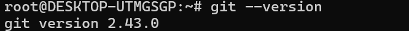

# is310-coding-assignments
## Proof of Installation

1. Python

2. Git

3. VS Code

4. AI Tool/Workflow 

I plan to use AI very sparingly (if at all) in this course, if I use AI it would be as a sort of "search engine" to aid in understanding topics.
